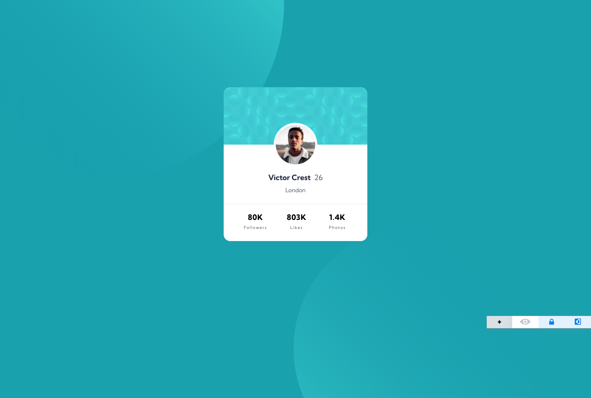
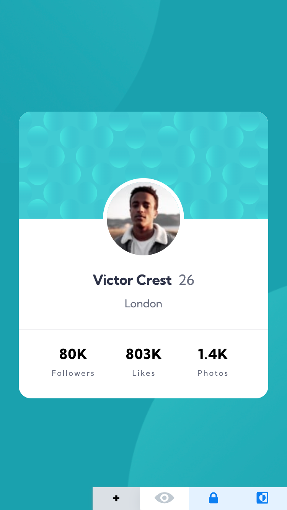

# Frontend Mentor - Profile card component solution

## Welcome! 👋

# Frontend Mentor - Profile card component solution

This is a solution to the [Profile card component challenge on Frontend Mentor](https://www.frontendmentor.io/challenges/profile-card-component-cfArpWshJ). Frontend Mentor challenges help you improve your coding skills by building realistic projects. 

### The challenge

- Build out the project to the designs provided

## Live site

🚀 [https://waquintero-ia.github.io/profileCard/]()

## Solution URL
🚀 [https://www.frontendmentor.io/solutions/profile-card-component-react-tailwind-SyIIjP-e7V]()

## Author

- Frontend Mentor - [@waquintero-ia](https://www.frontendmentor.io/profile/yourusername)

### Screenshot

Desktop

Mobile

